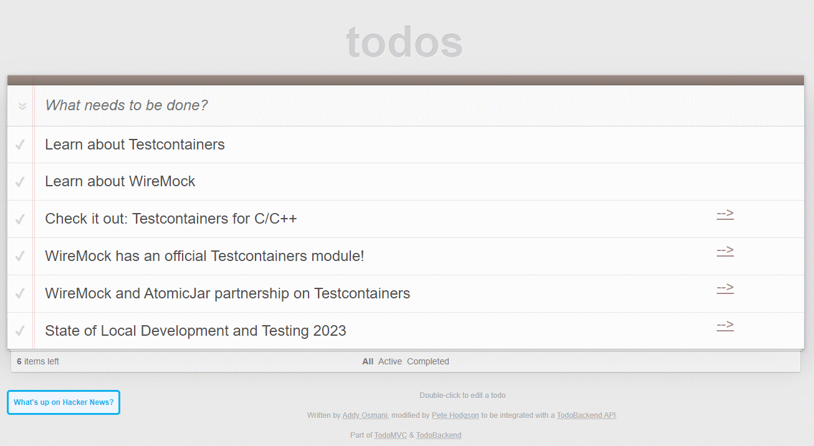

# Spring I/O - Testcontainers and WireMock Workshop

Shows a TODO list that also allows loading top stories for reading from Hackernews...
and also loading them from a [WireMock](https://wiremock.org/) mock API
running in [Testcontainers](https://www.testcontainers.org/).

## Prerequisites

* Docker Desktop or another Testcontainers-enabled engine

## Workshop Plan

### Getting Started - Local database

1. Clone this repository or download and unzip it.
2. Run the database with `docker compose up`
3. Run application locally with `./gradlew bootRun`
4. Open the application in the browser: [link](http://localhost:8080/?http://localhost:8080/todos)
5. Click the _What's up on Hackernews?_ to see what new get loaded for your reading list!

### Part I. Containers for Development

Let's write a few tests with Testcontainers

1. We will use Postgres in a Container
2. We can use Developer Services. They are [available](https://docs.spring.io/spring-boot/reference/features/dev-services.html) in Spring Boot, too!
3. Uncomment `withDevServices` in `gradle.settings.kts`

Task: We have a database with the migration script.
Let's test that we use the right versions and can actually migrate.

### Part II. Now with WireMock

For this part, we will download additional reading tasks from Hacker News.
They have a [public API](https://github.com/HackerNews/API).

* There is a Spring Boot integration, 
   now a part of the WireMock organization: [WireMock Spring Boot](https://github.com/wiremock/wiremock-spring-boot)
* There is a Testcontainers module for WireMock that embeds everything:
  [wiremock/wiremock-testcontainers-java](https://github.com/wiremock/wiremock-testcontainers-java).
  We use it in the workshop.
* You can use a Dev Service too.
 
Steps:

1. Try the application against the production server. It might work... or not
2. Enable the WireMock service in Docker Compose by uncommenting the bits in 
   `docker-compose.yml`, `gradle.properties` and `application.yml`
2. Check out the `ContainersConfig` class to see how elegant the Spring Boot and Testcontainers integration is now.
Let's write a few tests for the Hackernews API provider with them.
2. Check out the WireMock JSON and how non-elegant it is
3. See `ApplicationTests` for wiring examples

Tasks:

4. Write a new test that roundrips the data, for a new Hackernews entry about Spring I/O
5. Add a new test with a server that returns error - no Data found, and validates the client behavior for it
6. BONUS: Add a test that configures WireMock on the flight... in code

### Part 3. Let's add some AI?

* Docker Model Runner: https://docs.docker.com/model-runner/
* Spring AI: https://spring.io/projects/spring-ai

Get started: 

1. Pull the model using `docker pull ai/qwen3:30B-A3B-Q4_K_M` (for reasonable results) or `ai/smollm2:135M-Q2_K` (for minimum PoC)
2. Add Spring AI to your project
3. Configure it to refer the Docker Model Runner

### Screenshot

Demo app after loading Hacker News best stories from the WireMock container:

## What we didn't show

* In this edition, we didn't touch Testcontainers Desktop. 
  For that, see the 2023-2024 talks below.
* We do not show running WireMock and Testcontainers inside Gradle builds.
  You can do it if needed.

## References

- [Video from the Devoxx BE talk](https://www.youtube.com/watch?v=eFILbyaMI2A) - see the _Mega Demo_ part for this demo (from ~30:00)
- [Slides from the Devoxx BE 2023 talk](https://docs.google.com/presentation/d/e/2PACX-1vQSgTTCg-LkmrL-5UuAE63zxuWP0kADBetXXBqMVO-oEQWfP6zGu16eFSdKxvEbchDnaCwKZ2a7134F/pub?start=false&loop=false&delayms=3000)
- [WireMock Module for Testcontainers](https://testcontainers.com/modules/wiremock/)
- [HackerNews Mock API](https://library.wiremock.org/catalog/api/y/ycombinator.com/hackernews_v0/) on the
  [WireMock API Templates Library](https://library.wiremock.org/)
